# 🛰️ Praktikum Modul 3 AI 2026 — Satellite Image Classification

> **5027241103 — Ni'mah Fauziyyah Atok**  
> Deep Learning · From Scratch · Kaggle Competition

---

## 📋 Daftar Isi

1. [Eksplorasi Data (EDA)](#1-eksplorasi-data-eda)
2. [Preprocessing & Augmentasi](#2-preprocessing--augmentasi)
3. [Arsitektur Model](#3-arsitektur-model)
4. [Strategi Validasi & Evaluasi](#4-strategi-validasi--evaluasi)
5. [Inferensi & Submission](#5-inferensi--submission)

---

## 1. Eksplorasi Data (EDA)

> **Script:** [`eda.py`](eda.py)

Dataset terdiri dari **10 kelas** citra satelit dengan total ±21.000 gambar training dan ±5.000 gambar test.

### Distribusi Kelas

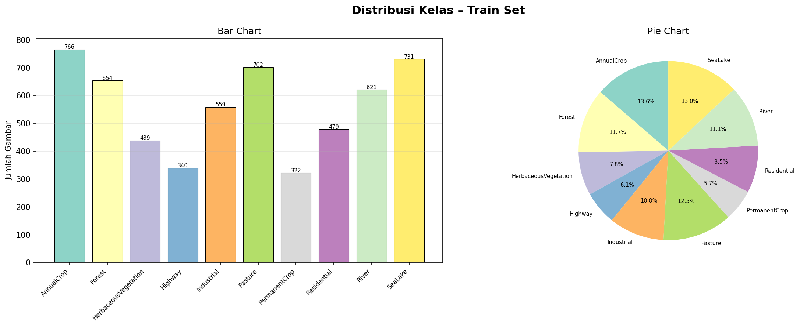

Dataset cukup **seimbang** — setiap kelas memiliki jumlah sampel yang hampir merata (~2.000 gambar/kelas), sehingga tidak diperlukan teknik resampling khusus.

### Sampel Gambar per Kelas

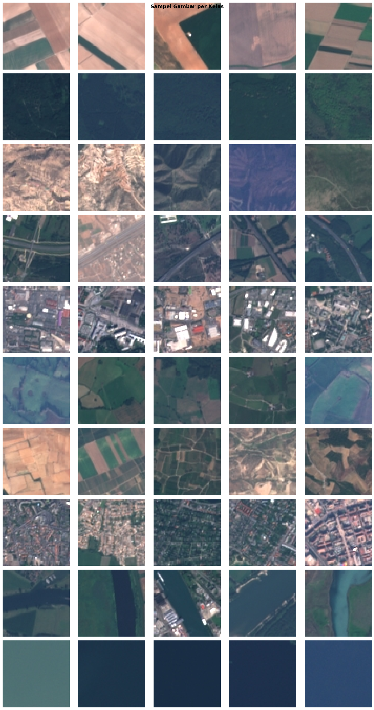

Setiap kelas memiliki karakteristik visual yang cukup berbeda, namun beberapa pasang kelas terlihat mirip secara visual (mis. `AnnualCrop` vs `PermanentCrop`, `Forest` vs `HerbaceousVegetation`).

### Distribusi Ukuran Gambar

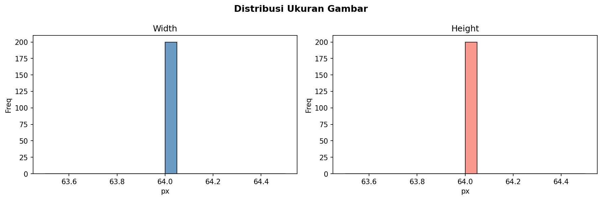

Semua gambar memiliki ukuran **64×64 piksel** — konsisten di seluruh dataset, tidak perlu resize adaptif.

### Analisis Kecerahan (Brightness) per Kelas

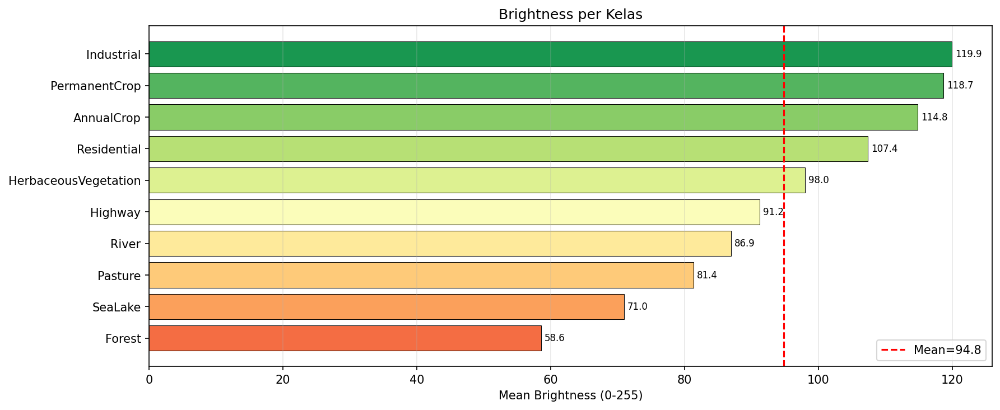

Kelas `SeaLake` dan `River` memiliki brightness yang lebih rendah dibanding `Pasture` dan `AnnualCrop`. Ini memberikan sinyal visual yang berguna bagi model.

### Analisis Saluran RGB per Kelas

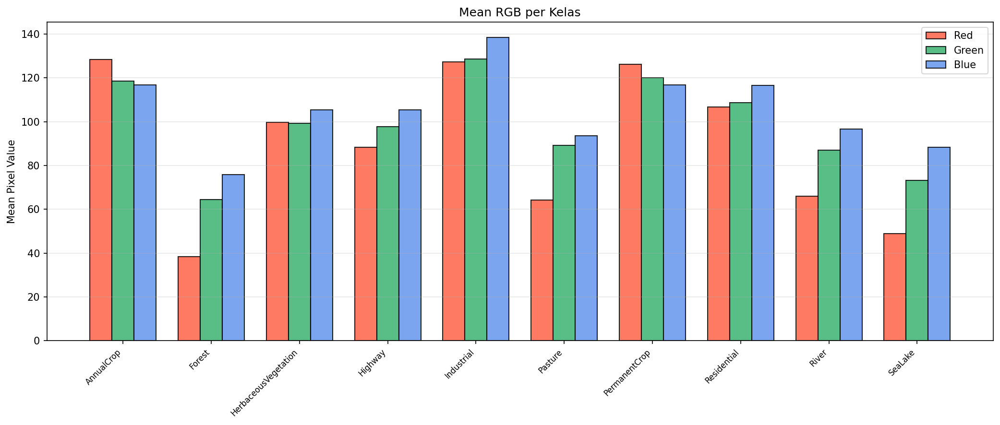

Kelas vegetasi (`Forest`, `HerbaceousVegetation`, `Pasture`) dominan di saluran **Green**, sedangkan kelas `Residential` dan `Industrial` cenderung merata di semua saluran — mencerminkan material buatan manusia.

### Perbandingan Kelas yang Mirip Secara Visual

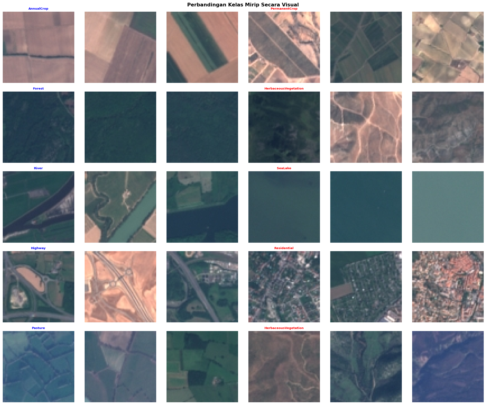

Pasangan kelas yang paling sulit dibedakan:
- `AnnualCrop` ↔ `PermanentCrop` — pola pertanian serupa
- `Forest` ↔ `HerbaceousVegetation` — sama-sama vegetasi
- `River` ↔ `SeaLake` — sama-sama badan air

---

## 2. Preprocessing & Augmentasi

> **Script:** [`train_resnet.py`](train_resnet.py) · [`train_efficient.py`](train_efficient.py)

### Pipeline Preprocessing

```python
val_transforms = transforms.Compose([
    transforms.Resize((64, 64)),
    transforms.ToTensor(),
    transforms.Normalize([0.485, 0.456, 0.406], [0.229, 0.224, 0.225])
])
```

Normalisasi menggunakan mean & std ImageNet agar distribusi pixel lebih stabil saat training.

### Pipeline Augmentasi (Training Only)

```python
train_transforms = transforms.Compose([
    transforms.Resize((64, 64)),
    transforms.RandomHorizontalFlip(),          # flip horizontal
    transforms.RandomVerticalFlip(),            # flip vertikal (citra satelit simetris)
    transforms.RandomRotation(30),              # rotasi ±30°
    transforms.ColorJitter(                     # variasi warna
        brightness=0.4, contrast=0.4,
        saturation=0.3, hue=0.1
    ),
    transforms.RandomResizedCrop(64,            # crop acak
        scale=(0.75, 1.0)),
    transforms.RandomGrayscale(p=0.05),         # grayscale sesekali
    transforms.ToTensor(),
    transforms.Normalize([0.485, 0.456, 0.406], [0.229, 0.224, 0.225])
])
```

**Alasan augmentasi untuk citra satelit:**
- `RandomVerticalFlip` — citra satelit tidak memiliki orientasi "atas-bawah" yang tetap
- `ColorJitter` — kondisi pencahayaan bervariasi antar waktu perekaman
- `RandomResizedCrop` — mensimulasikan variasi zoom/resolusi satelit

---

## 3. Arsitektur Model

> **Script:** [`train_resnet.py`](train_resnet.py) · [`train_efficient.py`](train_efficient.py)

Dua model dibangun **dari scratch** tanpa pretrained weights.

---

### Model 1 — Custom ResNet

```
Input (3×64×64)
    │
    ▼
Stem: Conv2d(3→64) + BN + ReLU
    │
    ▼
Layer 1: ResidualBlock(64→64) × 2
    │
    ▼
Layer 2: ResidualBlock(64→128, stride=2) × 2
    │
    ▼
Layer 3: ResidualBlock(128→256, stride=2) × 2
    │
    ▼
Layer 4: ResidualBlock(256→512, stride=2) × 2
    │
    ▼
AdaptiveAvgPool2d(1) → Dropout(0.4) → FC(512→10)
```

**Residual Block:**
```python
class ResidualBlock(nn.Module):
    # Conv(3×3) → BN → ReLU → Conv(3×3) → BN
    # + Skip Connection (dengan 1×1 Conv jika dimensi berbeda)
    # → ReLU
```

| Parameter | Nilai |
|-----------|-------|
| Total Parameters | ~11.2M |
| Optimizer | AdamW |
| Scheduler | CosineAnnealingLR |
| Loss | CrossEntropyLoss (label_smoothing=0.1) |
| Epochs | 40 |
| Batch Size | 64 |

---

### Model 2 — Custom EfficientNet

```
Input (3×64×64)
    │
    ▼
Stem: Conv2d(3→32) + BN + SiLU
    │
    ▼
MBConv(32→16,  expand=1, stride=1)
MBConv(16→24,  expand=6, stride=1)
MBConv(24→40,  expand=6, stride=2)
MBConv(40→80,  expand=6, stride=2)
MBConv(80→112, expand=6, stride=1)
MBConv(112→192,expand=6, stride=2)
MBConv(192→320,expand=6, stride=1)
    │
    ▼
Head: Conv(320→1280) + BN + SiLU
      + AdaptiveAvgPool → Dropout(0.3) → FC(1280→10)
```

**MBConv Block (Mobile Inverted Residual + Squeeze-Excite):**
```python
Expand (1×1 Conv) → Depthwise Conv (3×3) →
Squeeze-Excite (channel attention) → Pointwise Conv (1×1)
+ Residual jika in_ch == out_ch dan stride == 1
```

| Parameter | Nilai |
|-----------|-------|
| Total Parameters | ~3.6M |
| Optimizer | AdamW |
| Scheduler | OneCycleLR (max_lr=5e-3) |
| Loss | CrossEntropyLoss (label_smoothing=0.1) |
| Epochs | 40 |
| Batch Size | 64 |

---

## 4. Strategi Validasi & Evaluasi

> **Script:** [`error_analysis.py`](error_analysis.py)

### Strategi Validasi

- **Split:** 85% training / 15% validasi — menggunakan `random_split` dengan seed tetap (`SEED=42`) agar reproducible
- **Metrik Utama:** Macro F1 Score (sesuai metrik kompetisi Kaggle)
- **Best Model Checkpoint:** model disimpan setiap kali val F1 membaik

### Training History

| | ResNet | EfficientNet |
|--|--------|--------------|
| **Training Curve** | 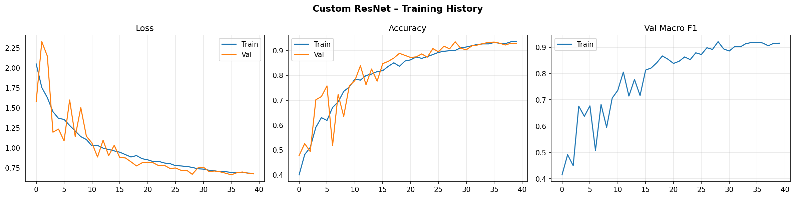 | 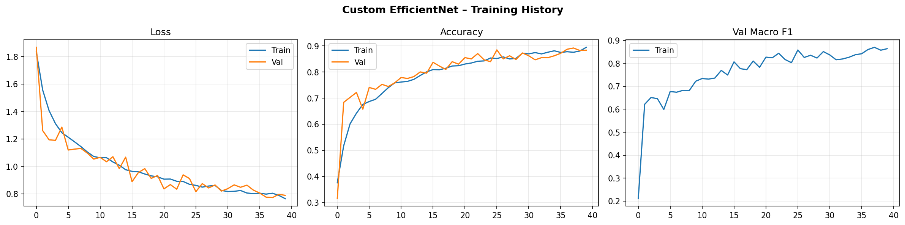 |

### Confusion Matrix

| | ResNet | EfficientNet |
|--|--------|--------------|
| **Confusion Matrix** | 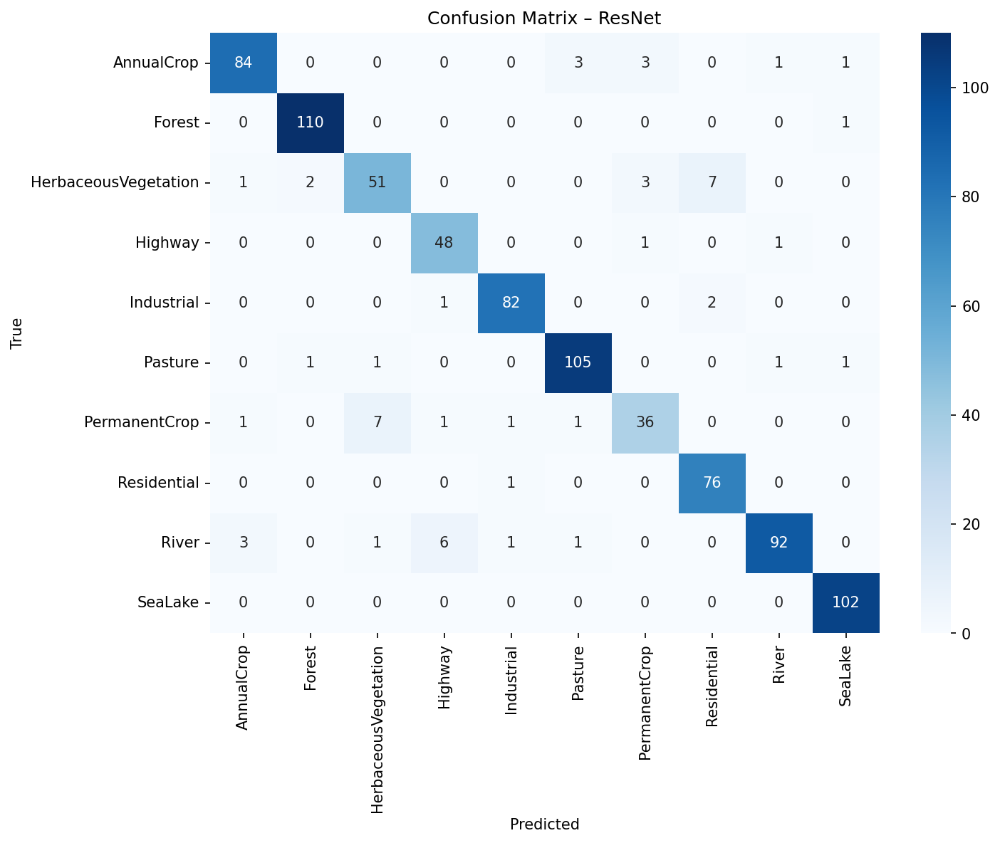 | 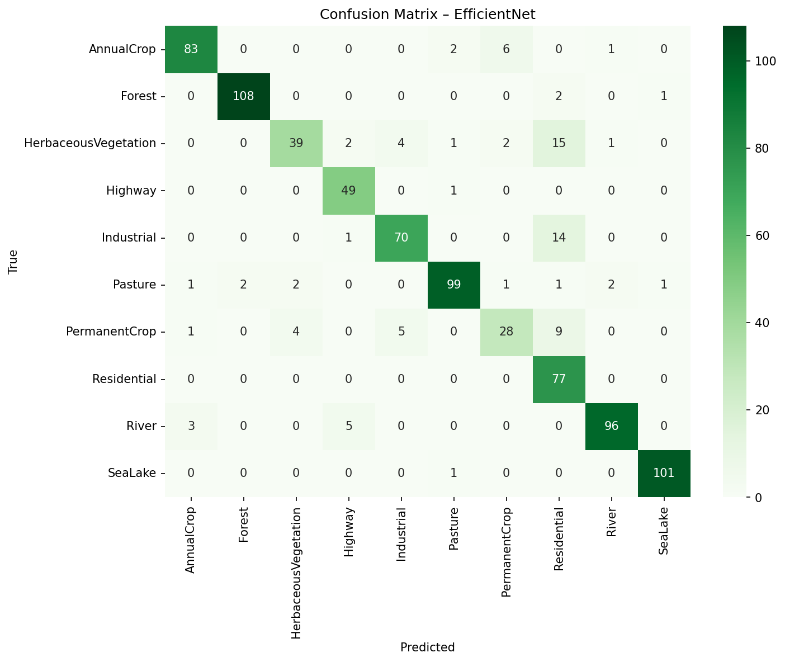 |

### Perbandingan Confusion Matrix (Error Analysis)

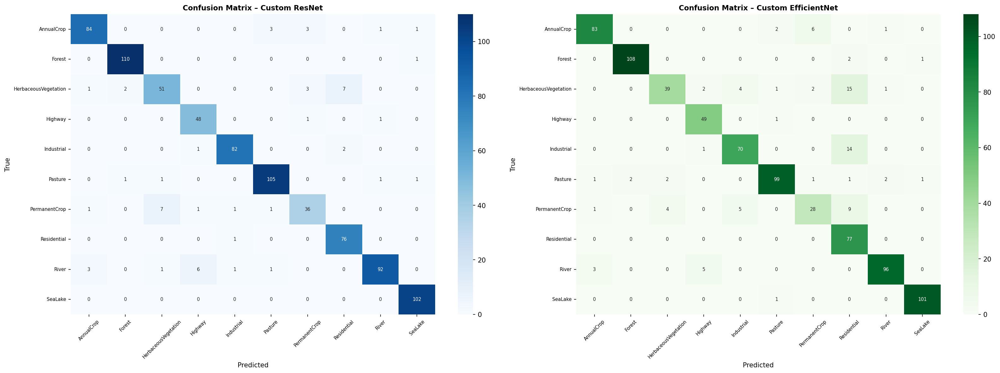

### Per-Class F1 Score

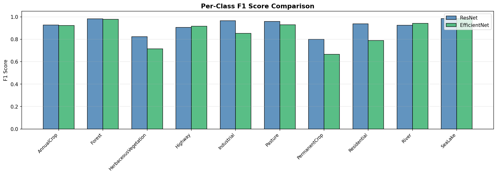

**Observasi:**
- Kedua model kesulitan pada kelas `HerbaceousVegetation` — mirip secara visual dengan `Forest` dan `Pasture`
- `SeaLake` dan `Industrial` adalah kelas yang paling mudah diprediksi di kedua model

### Sampel Misklasifikasi

| ResNet | EfficientNet |
|--------|--------------|
| 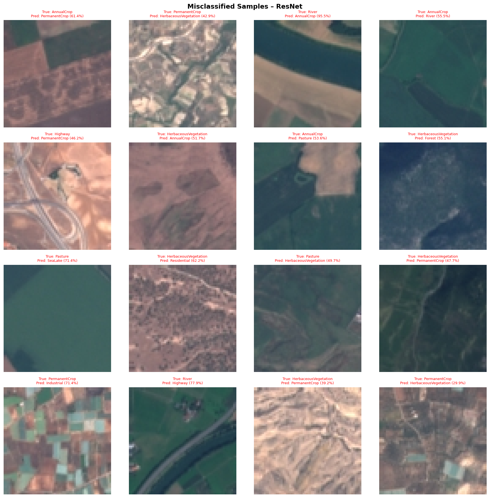 | 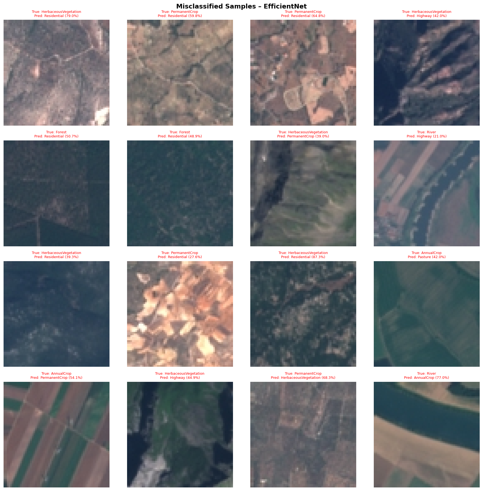 |

### Most Confused Pairs

| ResNet | EfficientNet |
|--------|--------------|
| 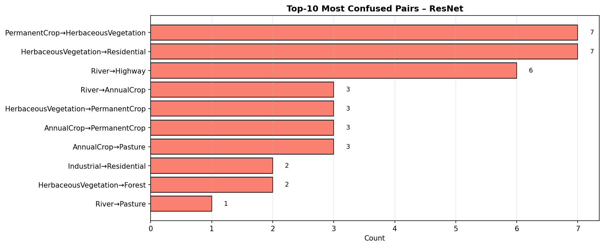 | 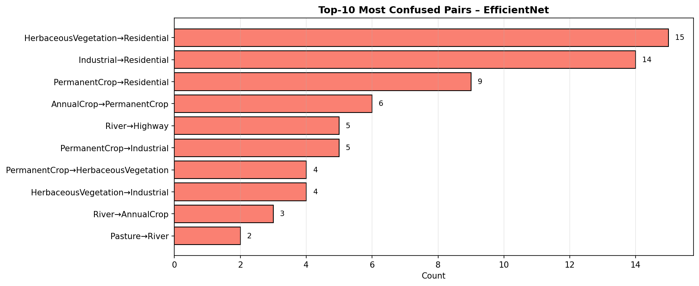 |

---

## 5. Inferensi & Submission

> **Script:** [`inference.py`](inference.py)

### Strategi Inferensi

Menggunakan **TTA (Test-Time Augmentation)** + **Ensemble** kedua model:

```python
# TTA: 4 augmentasi per gambar → rata-rata probabilitas
probs_resnet    = predict_with_tta(model_resnet, test_files)      # 4 aug
probs_efficient = predict_with_tta(model_efficient, test_files)   # 4 aug

# Ensemble: rata-rata logit kedua model
probs_ensemble = (probs_resnet + probs_efficient) / 2
preds_final    = probs_ensemble.argmax(axis=1)
```

**Keuntungan TTA + Ensemble:**
- Mengurangi variance prediksi pada gambar yang ambigu
- Menggabungkan kelebihan arsitektur ResNet (feature hierarchy) dan EfficientNet (channel attention)

### Bukti Eksekusi

| Training ResNet | Training EfficientNet |
|---|---|
| 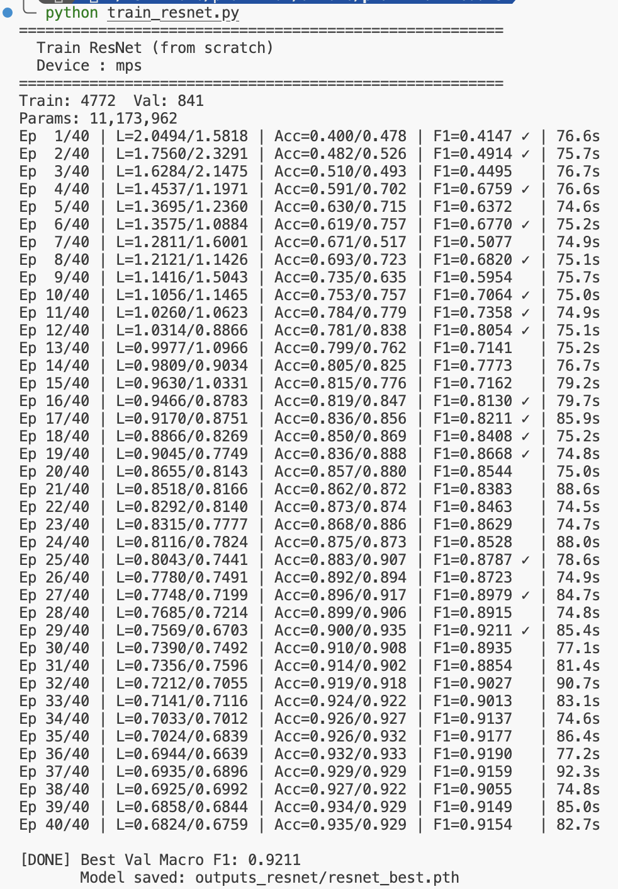 | 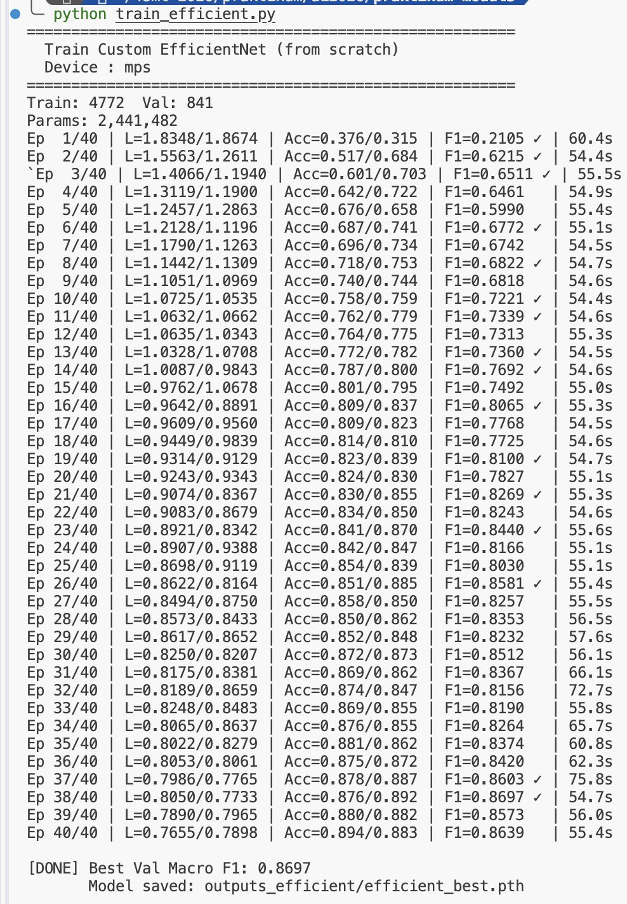 |
| 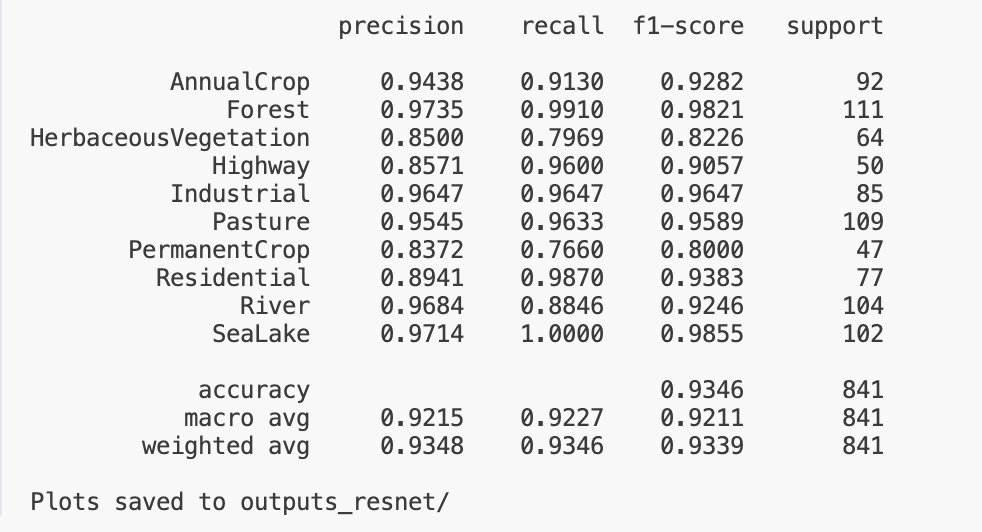 | 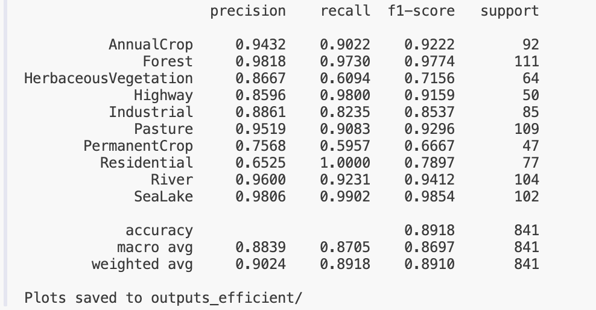 |


### Output Submission

File `submission.csv` berformat:

```
image_id,label
test_00001.jpg,Forest
test_00002.jpg,AnnualCrop
...
```

---

## 📁 Struktur Direktori

```
praktikum-modul3/
│
├── 📓 5027241103_Ni'mah Fauziyyah A_Modul 3.ipynb   ← Notebook utama
├── 📓 5027241103_Ni'mah Fauziyyah A_Modul 3_Kaggle.ipynb  ← Versi Kaggle (GPU T4×2)
│
├── 🐍 eda.py                 ← Fase 1: Exploratory Data Analysis
├── 🐍 train_resnet.py        ← Fase 2 & 3: Training Custom ResNet
├── 🐍 train_efficient.py     ← Fase 2 & 3: Training Custom EfficientNet
├── 🐍 error_analysis.py      ← Fase 4: Error Analysis
├── 🐍 inference.py           ← Fase 5: Inferensi & Generate Submission
│
├── 📂 eda_outputs/           ← Visualisasi EDA
│   ├── 01_class_distribution.png
│   ├── 02_sample_images.png
│   ├── 03_image_sizes.png
│   ├── 04_brightness.png
│   ├── 05_rgb_per_class.png
│   └── 06_similar_classes.png
│
├── 📂 outputs_resnet/        ← Hasil Training ResNet
│   ├── resnet_best.pth
│   ├── training_history.png
│   └── confusion_matrix.png
│
├── 📂 outputs_efficient/     ← Hasil Training EfficientNet
│   ├── efficient_best.pth
│   ├── training_history.png
│   └── confusion_matrix.png
│
├── 📂 error_analysis_outputs/ ← Visualisasi Error Analysis
│   ├── 01_confusion_compare.png
│   ├── 02_perclass_f1.png
│   ├── 03_misclassified_resnet.png
│   ├── 03_misclassified_efficientnet.png
│   ├── 04_confused_pairs_resnet.png
│   └── 04_confused_pairs_efficientnet.png
│
├── 📂 bukti/                 ← Screenshot bukti eksekusi
│   ├── 01-resnet1.png
│   ├── 02-resnet2.png
│   ├── 03-eff1.png
│   ├── 04-eff2.png
│   └── Screenshot 2026-05-04 at 15.08.52.png
│
└── 📄 submission.csv         ← File submission Kaggle
```

---

## ⚙️ Cara Menjalankan

```bash
# 1. Install dependencies
pip install torch torchvision scikit-learn matplotlib seaborn pillow pandas numpy

# 2. EDA
python eda.py

# 3. Training
python train_resnet.py
python train_efficient.py

# 4. Error Analysis
python error_analysis.py

# 5. Inferensi & Generate Submission
python inference.py
```

---

<div align="center">

**5027241103 · Ni'mah Fauziyyah Atok · Praktikum AI 2026 · Modul 3**

</div>
